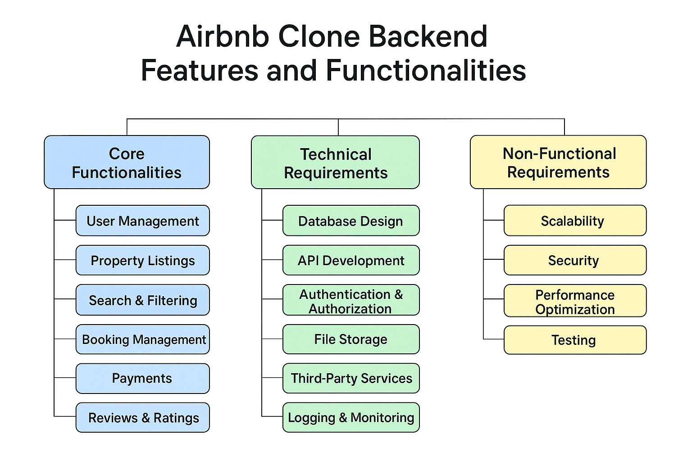

# 🏠 Airbnb Clone Backend — Requirements Document

## 📘 Overview
This document defines the **functional** and **non-functional requirements** for the Airbnb Clone backend system.  
The backend will manage users, listings, bookings, and payments while integrating with external services for email notifications and financial transactions.

---

## ⚙️ Step-by-Step Breakdown

### **1. Project Objective**
The goal of this project is to design and implement a robust backend system that supports core Airbnb-like functionalities:
- User authentication and roles (Guest, Host, Admin)
- Property listing management
- Booking management
- Payment processing (guest payments and host payouts)
- Email notifications and system monitoring

---

### **2. Key Actors and Roles**
| Actor | Description |
|-------|--------------|
| **Guest** | Registers, browses listings, books properties, and makes payments. |
| **Host** | Manages property listings, reviews bookings, and receives payouts. |
| **Admin** | Manages users, oversees payments, and handles disputes. |
| **Payment Gateway (External)** | Processes guest payments and host payouts. |
| **Email Service (External)** | Sends notifications and alerts to users. |

---

### **3. Core Functionalities**

#### **User Management**
- User registration and login with authentication tokens
- Role-based access (Guest, Host, Admin)
- Profile management (update email, contact, photo, etc.)

#### **Property Management**
- Hosts can add, update, or delete property listings
- Each property includes title, location, price, and amenities
- Guests can browse and search properties by filters

#### **Booking System**
- Guests can book available listings
- Hosts can accept or reject booking requests
- Booking history and status tracking for both users

#### **Payment System**
- Guests make payments through an integrated **Payment Gateway**
- Hosts receive payouts after successful stays (**Cash Out feature**)
- Admins can view and manage transactions
- Refund and dispute management capabilities

#### **Notification System**
- Automatic email confirmations for registration, booking, and payments
- Admin notifications for new disputes or failed transactions

---

### **4. Non-Functional Requirements**
| Category | Requirement |
|-----------|-------------|
| **Performance** | Handle 100+ concurrent users without lag. |
| **Scalability** | Support microservices or modular API structure. |
| **Security** | Implement JWT authentication and data encryption. |
| **Reliability** | 99.5% uptime with automatic error logging. |
| **Maintainability** | Use a clean MVC or layered architecture. |

---

### **5. External Integrations**
- **Payment Gateway (e.g., Paystack, Stripe)** — for guest payments and host payouts.  
- **Email Service (e.g., SendGrid, Nodemailer)** — for transactional notifications.  
- **Cloud Storage (optional)** — for hosting property images.

---

### **6. System Interactions (Use Case Summary)**
| Actor | Use Case | Description |
|--------|-----------|-------------|
| Guest | Register / Login | Create or access an account |
| Guest | Book Property | Select and book a listing |
| Guest | Make Payment | Complete booking payment |
| Host | Add / Manage Listings | Create and edit property details |
| Host | Receive Payout | Cash out after completed booking |
| Admin | Manage Users | View and control user activity |
| Admin | Manage Payments | View or approve transactions |
| Payment Gateway | Process Transactions | Handle all payments and payouts |
| Email Service | Send Notifications | Send confirmation and alerts |

---

### **7. System Diagram Reference**

